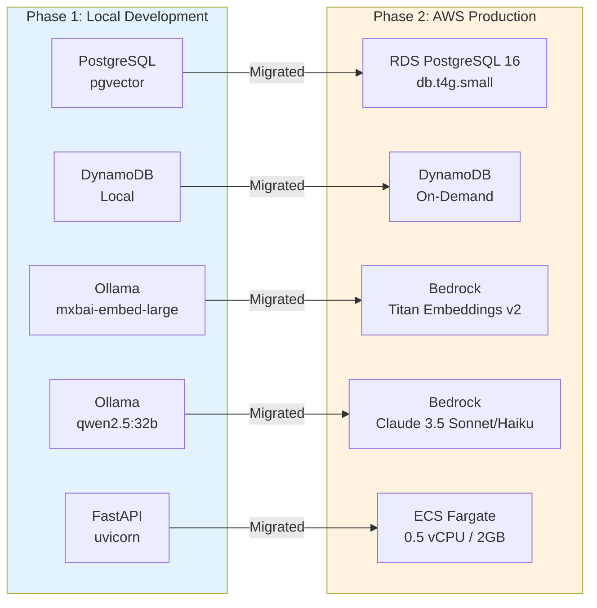
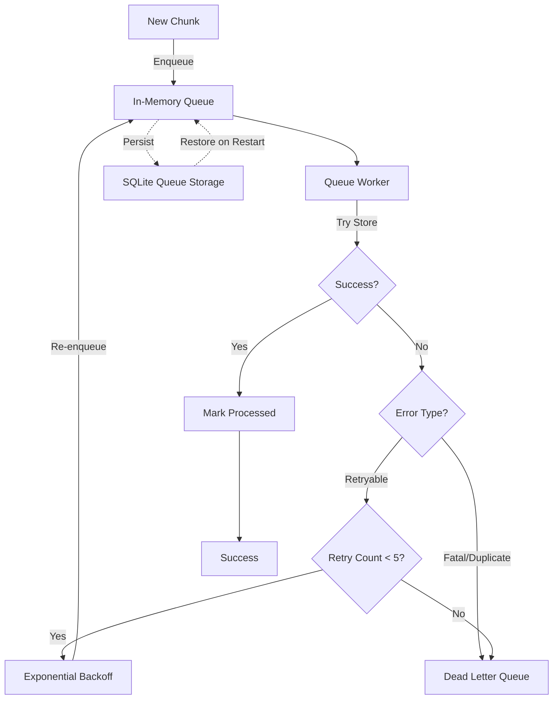

# hc_ai - Healthcare RAG System: Technical Documentation

> **Professional Portfolio:** This documentation showcases a production healthcare RAG system demonstrating expertise in full-stack AI engineering, cloud architecture, and cost-conscious system design. The system evolved from a local development environment to a lean AWS production deployment serving real queries at ~$124/month.

---

## Table of Contents

1. [System Overview & Architecture](#1-system-overview--architecture)
2. [Data Ingestion & Processing Pipeline](#2-data-ingestion--processing-pipeline)
3. [Vector Storage & Retrieval](#3-vector-storage--retrieval)
4. [Agent System & LangGraph](#4-agent-system--langgraph)
5. [Session Management](#5-session-management)
6. [API Architecture](#6-api-architecture)
7. [Frontend Interface](#7-frontend-interface)
8. [Metrics & Evaluation](#8-metrics--evaluation)
9. [AWS Production Architecture](#9-aws-production-architecture)
10. [What I'd Do With More Resources](#10-what-id-do-with-more-resources)

---

## 1. System Overview & Architecture

### Executive Summary

**hc_ai** is a production Retrieval-Augmented Generation (RAG) system designed for healthcare applications. It processes synthetic FHIR (Fast Healthcare Interoperability Resources) data, generates semantic embeddings, and provides intelligent query capabilities through a multi-agent AI system.

**Production Scale:**
- **91,000 patients** with complete medical histories
- **7.7 million vector chunks** (1024-dimensional embeddings)
- Running on AWS at **~$124/month**

**Key Capabilities:**
- **FHIR Data Processing**: Parses and chunks complex healthcare records maintaining JSON structure integrity
- **Semantic Search**: 1024-dimensional vector embeddings with hybrid search (BM25 + semantic)
- **Intelligent Agent**: LangGraph-based agent with Claude 3.5 Sonnet (reasoning) and Haiku (synthesis), plus 28 healthcare-specific tools
- **Production-Ready**: Deployed on AWS ECS Fargate with RDS PostgreSQL, Bedrock LLM, and real-time observability
- **Cost-Conscious Design**: Evolved from local development to lean AWS production (~$124/month)

### Design Philosophy & Journey

This system demonstrates a **practical engineering journey** from local development to production:

1. **Phase 1 — Local Development**: Complete development environment using PostgreSQL, DynamoDB Local, and Ollama. Zero cloud costs during development and experimentation.
2. **Phase 2 — AWS Migration**: Migrated to ECS Fargate, RDS PostgreSQL, and Bedrock Claude. Discovered and resolved critical production issues (sync I/O deadlocks, index performance at scale, event loop blocking).
3. **Phase 3 — Production Tuning**: PostgreSQL performance optimization, IVFFlat indexing, btree indexes for metadata filters, cold start optimization, and real-time CloudWatch observability.

The journey from local to production revealed challenges that only appear at scale — 7.7M vectors don't behave like 100K, and a single-worker uvicorn server exposes every blocking call.

---

### Phase 1: Local Development


**Technology Stack (Local):**

| Component | Technology | Purpose | Port |
|-----------|-----------|---------|------|
| **Data Source** | FHIR Bundle JSON | Synthetic patient records (Synthea) | - |
| **Parser** | Go | Efficient FHIR resource extraction | - |
| **API** | FastAPI (Python) | RESTful API with async processing | 8000 |
| **Chunking** | RecursiveJsonSplitter | JSON-aware text chunking | - |
| **Embeddings** | Ollama + mxbai-embed-large | 1024-dim embeddings (local) | 11434 |
| **Vector DB** | PostgreSQL + pgvector | Vector similarity search | 5432 |
| **Session Store** | DynamoDB Local | Conversation management | 8001 |
| **Queue** | SQLite | Persistent retry queue | - |
| **LLM** | Ollama + qwen2.5:32b | Agent reasoning | 11434 |
| **Frontend** | Next.js | Web interface | 3000 |

**Key Features:**
- **Zero Cloud Costs**: Entire stack runs locally for development
- **Production Parity**: Architecture mirrors AWS deployment pattern
- **Fast Iteration**: Hot reload for API and frontend development

---

### Phase 2: AWS Production (Current)


**Technology Stack (AWS Production):**

| Component | AWS Service | Configuration | Cost |
|-----------|------------|---------------|------|
| **API** | ECS Fargate | 0.5 vCPU, 2GB RAM, single task | ~$21/mo |
| **LLM** | Bedrock Claude | Sonnet (researcher) + Haiku (response) | ~$46/mo |
| **Embeddings** | Bedrock Titan | amazon.titan-embed-text-v2:0 (1024-dim) | ~$0.20/mo |
| **Vector DB** | RDS PostgreSQL 16 | db.t4g.small (2 vCPU, 2GB RAM, 250GB gp3) | ~$52/mo |
| **Session Store** | DynamoDB | On-demand pricing | ~$2/mo |
| **FHIR Storage** | S3 Standard | ~100GB synthetic data | ~$2.50/mo |
| **Container Registry** | ECR | Docker image storage | ~$0.20/mo |
| **Frontend** | Vercel | Next.js deployment | Free tier |
| **CI/CD** | GitHub Actions | Build → ECR → ECS deploy | Free tier |
| **Monitoring** | CloudWatch | ECS/RDS/ALB metrics | Included |
| **Total** | | | **~$124/mo** |

---

### Architecture Comparison



---

### Technology Stack Deep Dive

#### Programming Languages & Frameworks

**Backend:**
- **Python 3.12**: Core API, processing, and agent logic
- **Go 1.19+**: High-performance FHIR data parsing
- **FastAPI**: Modern async Python web framework
- **LangChain**: LLM orchestration and tooling
- **LangGraph**: Multi-agent state machine framework

**Frontend:**
- **TypeScript 5.9**: Type-safe React development
- **Next.js 16.1**: React framework with server-side rendering
- **Material-UI 7.3 + TailwindCSS 4**: Component library and utility-first styling
- **Recharts**: Data visualization (observability dashboard)
- **Framer Motion**: Animations and transitions

**Infrastructure:**
- **Docker**: Containerization (Python 3.12-slim base)
- **GitHub Actions**: CI/CD pipeline (build → ECR → ECS deploy)
- **ECS Fargate**: Serverless container hosting

#### Data Processing
- **RecursiveJsonSplitter**: JSON-aware chunking preserving FHIR structure
- **pgvector**: PostgreSQL extension for vector similarity search
- **BM25**: Full-text keyword search for exact matches (ICD-10, LOINC codes)

#### AI/ML Stack
- **Embeddings**:
  - Local: mxbai-embed-large via Ollama (1024 dimensions)
  - Production: Amazon Titan Embeddings v2 via Bedrock (1024 dimensions)
- **LLM**:
  - Local: qwen2.5:32b via Ollama (recommended for 24GB VRAM)
  - Production: Claude 3.5 Sonnet (researcher/reasoning) + Claude 3.5 Haiku (synthesis/validation) via Bedrock
  - Dual-provider support: `LLM_PROVIDER=ollama|bedrock`

**Model Selection Guide (Local Development, 24GB VRAM / RTX 4090):**

| Model | VRAM | Notes |
|-------|------|-------|
| `qwen2.5:32b` | ~20GB | **Recommended** - Best instruction following for complex medical prompts |
| `mixtral:8x7b` | ~26GB | Good MoE alternative |
| `llama3.1:8b` | ~5GB | Too small - hallucinates from prompt examples |
| `llama3.1:70b` | ~40GB | Requires CPU offload on 4090, slow |

> **Key insight:** 8B-parameter models cannot distinguish few-shot examples from real patient data. Use 32B+ for medical agents to prevent example data hallucination.

- **Reranking**: sentence-transformers/all-MiniLM-L6-v2 cross-encoder

---

### System Characteristics

**Scale:**
- 91,000 patients, 7.7 million chunks, 1024-dimensional embeddings
- Single-worker uvicorn on ECS Fargate (0.5 vCPU, 2GB RAM)

**Scalability:**
- Async processing with background tasks
- Connection pooling (10 pool size, 5 overflow)
- Batch operations for vector storage
- All sync I/O wrapped in `asyncio.to_thread()` to prevent event loop blocking

**Reliability:**
- Exponential backoff retry mechanism (max 5 retries)
- Dead Letter Queue for failed chunks
- Persistent queue (SQLite) survives restarts
- Comprehensive error classification (retryable, duplicate, fatal)

**Observability:**
- CloudWatch metrics (ECS CPU/Memory, ALB latency/requests, RDS CPU/connections)
- Real-time dashboard with sparkline trends
- Pipeline step timing visualization
- Structured debug logging with timing for search, embedding, and reranking operations

**Security:**
- PII masking (local regex-based)
- Input/output validation and guardrails
- Credentials management via environment variables
- Non-root container user

---

### Performance Characteristics

**At Production Scale (7.7M chunks, 91K patients):**

**Embedding Generation:**
- Production (Bedrock Titan): ~100ms per query embedding
- Local (Ollama): ~50-100ms per embedding

**Vector Search (patient-filtered with btree index):**
- Semantic search: ~100-500ms
- BM25 search: ~50-200ms
- Hybrid search: ~200-600ms (parallel execution)

**Cross-Encoder Reranking:**
- 50→10 candidates: ~200-500ms on CPU (ECS Fargate)

**Agent Execution:**
- Simple query (no tools): 3-8 seconds
- Complex multi-tool query: 10-30 seconds
- Agent timeout: 300 seconds (configurable)
- Streaming: Real-time SSE updates with 15s keepalive

**Infrastructure:**
- Cold start: 60-90s (model loading + vector store pre-warm on 0.5 vCPU)
- ALB idle timeout: 60s (mitigated by SSE keepalive comments every 15s)

> **Key lesson:** Before adding btree indexes on `patient_id` and `resource_type`, patient-filtered queries took **~39 seconds** (sequential scan across 7.7M rows). After indexing: **<100ms**. GIN indexes on JSONB don't help — you need separate btree indexes on the specific JSONB expression paths.

---

## Next Section Preview

In the next section, we'll dive deep into the **Data Ingestion & Processing Pipeline**, covering:
- FHIR Bundle structure and parsing with Go
- Intelligent JSON-aware chunking strategy
- Metadata extraction and enrichment
- Embedding generation pipeline
- Queue-based resilient storage

[Continue to Section 2: Data Ingestion & Processing Pipeline →](#2-data-ingestion--processing-pipeline)

---

## 2. Data Ingestion & Processing Pipeline

This section details the end-to-end data processing pipeline from raw FHIR Bundle files to searchable vector embeddings.

### Pipeline Overview


The pipeline consists of **8 stages** with built-in error handling and retry logic at every step.

---

### Stage 1: FHIR Bundle Data Structure

**Data Source**: Synthetic FHIR (Fast Healthcare Interoperability Resources) Bundles generated by [Synthea](https://github.com/synthetichealth/synthea)

**Bundle Structure**:
```json
{
  "resourceType": "Bundle",
  "type": "collection",
  "entry": [
    {
      "fullUrl": "urn:uuid:patient-id-123",
      "resource": {
        "resourceType": "Patient",
        "id": "patient-id-123",
        "name": [{"family": "Doe", "given": ["John"]}],
        "gender": "male",
        "birthDate": "1980-01-15"
      }
    },
    {
      "fullUrl": "urn:uuid:observation-id-456",
      "resource": {
        "resourceType": "Observation",
        "id": "observation-id-456",
        "status": "final",
        "code": {"coding": [{"system": "http://loinc.org", "code": "8302-2"}]},
        "effectiveDateTime": "2024-01-20T10:30:00Z",
        "valueQuantity": {"value": 72, "unit": "kg"}
      }
    }
  ]
}
```

**Resource Types Processed**:
- **Patient**: Demographics, identifiers
- **Condition**: Diagnoses, clinical status
- **Observation**: Lab results, vital signs
- **Procedure**: Medical procedures performed
- **MedicationRequest**: Prescriptions
- **Immunization**: Vaccination records
- **DiagnosticReport**: Test results and reports
- **Encounter**: Healthcare visits

**File Naming**: `{LastName}{FirstName}_{Age}.json` (e.g., `Abbott509_Aaron203_44.json`)

**Key Characteristics**:
- Realistic synthetic data (safe for public demo)
- Complete patient medical histories
- FHIR-compliant structure with standard coding systems (SNOMED CT, LOINC, ICD-10)
- Resource references via UUID fullUrl

---

### Stage 2: Go Parser - High-Performance Extraction

**Implementation**: `POC_embeddings/main.go`

**Why Go?**
- **Performance**: 5-10x faster than Python for JSON parsing
- **Concurrency**: Goroutines for parallel file processing
- **Type Safety**: Strong typing prevents parsing errors
- **Low Memory**: Efficient memory usage for large Bundle files

**Processing Logic**:

```go
func processFile(filePath string) {
    // 1. Read and parse FHIR Bundle
    bundle := parseBundle(filePath)

    // 2. Extract patient ID from Patient resource
    patientID := extractPatientID(bundle.Entry)

    // 3. Iterate through all resources in bundle
    for _, entry := range bundle.Entry {
        resource := entry.Resource
        resourceType := resource.ResourceType

        // 4. Extract human-readable content
        content := extractContent(resource, resourceType)

        // 5. Serialize full resource JSON
        resourceJSON := json.Marshal(resource)

        // 6. Build payload
        payload := ClinicalNote{
            ID:           resource.ID,
            FullURL:      entry.FullURL,
            ResourceType: resourceType,
            Content:      content,
            PatientID:    patientID,
            ResourceJSON: resourceJSON,
            SourceFile:   filePath,
        }

        // 7. HTTP POST to Python API
        sendToPipeline(payload)
    }
}
```

**Content Extraction Strategy**:
- **Patient**: Name, gender, birthDate, address
- **Condition**: Code display text, clinical status, onset date
- **Observation**: Code, value, unit, interpretation
- **Procedure**: Code display, performed date, body site
- **MedicationRequest**: Medication name, dosage instructions

**Error Handling**:
- Skips malformed resources with logging
- Continues processing even if individual resources fail
- Reports file-level errors

---

### Stage 3: FastAPI Ingestion Endpoint

**Implementation**: `api/embeddings/router.py`

**Endpoint**: `POST /embeddings/ingest`

**Request Model** (Pydantic):
```python
class ClinicalNote(BaseModel):
    id: str                    # FHIR resource ID
    fullUrl: str              # urn:uuid:...
    resourceType: str         # Patient, Observation, etc.
    content: str              # Extracted human-readable text
    patientId: Optional[str]  # Patient UUID
    resourceJson: str         # Full FHIR resource JSON
    sourceFile: Optional[str] # Original file path
```

**Validation**:
```python
if not note.content or len(note.content.strip()) == 0:
    raise HTTPException(
        status_code=400,
        detail=f"Content cannot be empty for resource {note.id}"
    )
```

**Async Processing**:
```python
@router.post("/ingest")
async def ingest_note(note: ClinicalNote, background_tasks: BackgroundTasks):
    # Immediately return 202 Accepted
    background_tasks.add_task(process_and_store, note)

    return {
        "status": "accepted",
        "id": note.id,
        "resourceType": note.resourceType,
        "contentLength": len(note.content)
    }
```

**Benefits**:
- Non-blocking: API responds immediately
- Resilient: Failures don't affect ingestion acceptance
- Scalable: Background tasks processed asynchronously

---

### Stage 4: Intelligent JSON-Aware Chunking

**Implementation**: `api/embeddings/utils/helper.py`

**Strategy**: RecursiveJsonSplitter (LangChain)

**Why JSON-Aware Chunking?**

FHIR resources have deep nested structures. Traditional text splitters would break JSON mid-object, losing context. RecursiveJsonSplitter:
- Preserves valid JSON structure
- Maintains parent-child relationships
- Splits at logical JSON boundaries (objects, arrays)
- Ensures each chunk is semantically complete

**Configuration**:
```python
splitter = RecursiveJsonSplitter(
    max_chunk_size=1000,  # Maximum characters
    min_chunk_size=500    # Minimum characters
)
```

**Example Split**:

Original FHIR Observation (1200 chars):
```json
{
  "resourceType": "Observation",
  "id": "obs-123",
  "status": "final",
  "category": [{"coding": [{"code": "laboratory"}]}],
  "code": {"coding": [{"system": "http://loinc.org", "code": "2093-3"}], "text": "Cholesterol Total"},
  "subject": {"reference": "Patient/456"},
  "effectiveDateTime": "2024-01-15",
  "valueQuantity": {"value": 195, "unit": "mg/dL"}
}
```

Split into 2 chunks:
- **Chunk 0** (850 chars): Basic metadata, status, category, code
- **Chunk 1** (350 chars): Subject reference, effectiveDateTime, value

**Fallback Strategy**:
```python
try:
    chunks = RecursiveJsonSplitter.split_text(resource_json)
except:
    # Fallback to character-based splitter
    chunks = RecursiveCharacterTextSplitter(
        chunk_size=1000,
        chunk_overlap=200
    ).split_text(content)
```

---

### Stage 5: Metadata Extraction & Enrichment

**Implementation**: `extract_resource_metadata()` in `api/embeddings/utils/helper.py`

**Extracted Metadata**:

```python
metadata = {
    # Identifiers
    "patient_id": "03e6006e-b8a0-49a5-9e97-8c08f2f66752",
    "resource_id": "a1adaf74-aeee-47a2-b096-247728c87cc2",
    "resource_type": "Observation",
    "full_url": "urn:uuid:a1adaf74-aeee-47a2-b096-247728c87cc2",
    "source_file": "../data/fhir/Abbott509_Aaron203_44.json",

    # Chunk Information
    "chunk_id": "a1adaf74-aeee-47a2-b096-247728c87cc2_chunk_0",
    "chunk_index": 0,
    "total_chunks": 2,
    "chunk_size": 850,

    # FHIR-Specific Metadata (extracted from resource JSON)
    "effective_date": "2024-01-15T10:30:00Z",
    "status": "final"
}
```

**Date Field Extraction** (resource-type aware):
```python
date_fields = {
    "Observation": ["effectiveDateTime", "issued"],
    "Condition": ["onsetDateTime", "recordedDate"],
    "Procedure": ["performedDateTime"],
    "MedicationRequest": ["authoredOn"],
    "Immunization": ["occurrenceDateTime"],
    "DiagnosticReport": ["effectiveDateTime"],
    "Encounter": ["period.start"],
    "Patient": ["birthDate"]
}
```

**Purpose**:
- **Filtering**: Search by patient, date range, resource type
- **Tracing**: Link back to original source file
- **Context**: Understand chunk position within resource
- **Temporal Queries**: Time-based retrieval

---

### Stage 6: Embedding Generation

**Production**: Amazon Bedrock Titan Embeddings v2
**Local Development**: Ollama + mxbai-embed-large

**Implementation** (dual-provider):
```python
# Provider determined by EMBEDDING_PROVIDER env var
EMBEDDING_PROVIDER = os.getenv("EMBEDDING_PROVIDER", "ollama")  # "ollama" | "bedrock"

# Synchronous (used during ingestion)
def get_chunk_embedding(text: str) -> List[float]:
    if EMBEDDING_PROVIDER == "bedrock":
        return _get_embeddings_bedrock(text)
    else:
        return _get_embeddings_ollama(text)

# Async wrapper (used during query-time to avoid blocking event loop)
async def async_get_chunk_embedding(text: str) -> List[float]:
    return await asyncio.to_thread(get_chunk_embedding, text)
```

> **Critical lesson:** On single-worker uvicorn, calling sync `get_chunk_embedding()` directly from an async function blocks the entire event loop. The `async_get_chunk_embedding()` wrapper via `asyncio.to_thread()` was added after discovering this caused request timeouts in production.

**Bedrock Implementation** (production):
```python
bedrock = boto3.client("bedrock-runtime", region_name="us-east-2")

def _get_embeddings_bedrock(text: str) -> List[float]:
    response = bedrock.invoke_model(
        modelId="amazon.titan-embed-text-v2:0",
        body=json.dumps({"inputText": text})
    )
    return json.loads(response["body"].read())["embedding"]
```

**Ollama Implementation** (local):
```python
def _get_embeddings_ollama(text: str) -> List[float]:
    response = requests.post(
        f"{OLLAMA_BASE_URL}/api/embeddings",
        json={"model": "mxbai-embed-large:latest", "prompt": text}
    )
    return response.json()["embedding"]
```

**Model Specifications**:
- **Dimensions**: 1024 (both providers)
- **Max Input**: 8192 tokens
- **Latency**: ~100ms (Bedrock), ~50-100ms (Ollama local)

---

### Stage 7: Queue-Based Resilient Storage

**Challenge**: Database connection limits, network failures, temporary outages

**Solution**: Async queue with exponential backoff retry

**Implementation**: `api/database/postgres.py`

**Queue Architecture**:



**Queue Configuration**:
```python
QUEUE_MAX_SIZE = 1000          # Max in-memory items
MAX_RETRIES = 5                # Retry attempts
RETRY_BASE_DELAY = 1.0         # Initial delay (seconds)
RETRY_MAX_DELAY = 60.0         # Max delay (seconds)
```

**Exponential Backoff**:
```python
delay = min(RETRY_BASE_DELAY * (2 ** retry_count), RETRY_MAX_DELAY)
# Retry 0: 1s
# Retry 1: 2s
# Retry 2: 4s
# Retry 3: 8s
# Retry 4: 16s
```

**Error Classification**:
```python
def classify_error(exc: Exception) -> str:
    msg = str(exc).lower()

    # Retryable errors (network, connection pool)
    if any(kw in msg for kw in ["connection", "timeout", "too many clients"]):
        return "retryable"

    # Duplicate (skip, already exists)
    if "duplicate key" in msg or "unique constraint" in msg:
        return "duplicate"

    # Fatal (data validation, schema errors)
    return "fatal"
```

**Persistent Queue** (SQLite):
- Survives application restarts
- Loads queued chunks on startup
- Minimal overhead (async writes)

**Dead Letter Queue (DLQ)**:
- Stores permanently failed chunks
- Includes error message and retry history
- Enables manual review and reprocessing

---

### Stage 8: PostgreSQL Vector Storage

**Implementation**: `api/database/postgres.py`

**Database**: PostgreSQL 16 + pgvector extension (RDS in production)

**Schema**: `hc_ai_schema`

**Table**: `hc_ai_table`

**Schema Definition**:
```sql
CREATE TABLE hc_ai_schema.hc_ai_table (
    langchain_id UUID PRIMARY KEY,
    content TEXT NOT NULL,
    embedding VECTOR(1024) NOT NULL,
    langchain_metadata JSONB
);

-- Vector similarity index (IVFFlat for approximate nearest neighbor)
CREATE INDEX ON hc_ai_schema.hc_ai_table
USING ivfflat (embedding vector_cosine_ops)
WITH (lists = 512);

-- Btree indexes for JSONB metadata filtering (critical for performance)
CREATE INDEX idx_hc_ai_patient_id
ON hc_ai_schema.hc_ai_table ((langchain_metadata->>'patient_id'));

CREATE INDEX idx_hc_ai_resource_type
ON hc_ai_schema.hc_ai_table ((langchain_metadata->>'resource_type'));
```

> **Key lesson:** GIN indexes on JSONB do NOT help with metadata equality filters at this scale. Separate btree indexes on the specific JSONB expression paths are required. Without the `idx_hc_ai_patient_id` btree index, patient-filtered queries sequentially scanned all 7.7M rows (~39 seconds). With the index: <100ms.

**Storage Logic**:
```python
async def store_chunk(chunk_text: str, chunk_id: str, metadata: Dict) -> bool:
    vector_store = await initialize_vector_store()

    doc = Document(
        id=chunk_id,
        page_content=chunk_text,
        metadata=metadata
    )

    await vector_store.aadd_documents([doc])
    return True
```

**Connection Pooling**:
```python
engine = create_async_engine(
    connection_string,
    pool_size=10,           # Max concurrent connections
    max_overflow=5,         # Additional connections when pool full
    pool_timeout=30,        # Wait time for connection
    pool_pre_ping=True      # Test connection before use
)
```

**Batch Operations**:
```python
async def store_chunks_batch(chunks: List[Dict]) -> int:
    documents = [
        Document(
            id=chunk['id'],
            page_content=chunk['text'],
            metadata=chunk['metadata']
        )
        for chunk in chunks
    ]

    # Single transaction, much faster than individual inserts
    await vector_store.aadd_documents(documents)
    return len(documents)
```

---

### Pipeline Performance Metrics

**End-to-End Processing Time** (per FHIR Bundle file):
- Go parsing: 50-100ms
- HTTP POST: 10-20ms
- Validation: 1-5ms
- Chunking: 20-50ms (depends on resource size)
- Embedding generation: ~100ms per chunk
- Queue + Storage: 10-30ms per chunk

**Example**: Patient Bundle with 50 resources, avg 2 chunks each (100 chunks total)
- Parsing + HTTP: ~100ms
- Chunking: 50ms x 50 resources = 2.5s
- Embeddings: 100ms x 100 chunks = 10s
- Storage: 20ms x 100 chunks = 2s
- **Total**: ~15 seconds

---

### Error Tracking & Observability

**Error Logging**:
```python
async def log_error(
    file_id: str,
    resource_id: str,
    chunk_id: str,
    error_type: str,  # validation, retryable, fatal, max_retries, queue_full
    error_message: str,
    metadata: Dict,
    retry_count: int
):
    # Store in PostgreSQL error log table
    await db.execute(
        "INSERT INTO error_logs VALUES (...)",
        {...}
    )
```

**API Endpoints for Monitoring**:
- `GET /db/errors`: Query error logs with filters
- `GET /db/errors/counts`: Aggregated error statistics
- `GET /db/queue`: Queue size and processing stats
- `GET /db/stats`: Database connection pool metrics

---

### Key Takeaways

This pipeline demonstrates:

- **Production-Ready Design**: Retry logic, error handling, persistent queues
- **Performance Optimization**: Async processing, connection pooling, batch operations
- **Data Integrity**: JSON-aware chunking, comprehensive metadata, validation
- **Observability**: Detailed logging, metrics, error tracking
- **Scalability**: Queue-based architecture, ready for distributed processing

[Continue to Section 3: Vector Storage & Retrieval →](#3-vector-storage--retrieval)

---

## 3. Vector Storage & Retrieval

This section covers the database architecture, retrieval strategies, and reranking pipeline that powers semantic search.

### Database Architecture

**PostgreSQL 16 + pgvector Extension (RDS)**

PostgreSQL was chosen for its:
- **Mature ecosystem**: Battle-tested RDBMS with excellent tooling
- **pgvector extension**: Native vector similarity search
- **JSONB support**: Flexible metadata storage and indexing
- **ACID compliance**: Data integrity guarantees
- **Cost-effective**: Open-source, runs on standard hardware


**Production Instance**: RDS db.t4g.small (2 vCPU, 2GB RAM, 250GB gp3 SSD)

---

### Schema Design

**Schema**: `hc_ai_schema`
**Table**: `hc_ai_table`

**Column Specifications**:

| Column | Type | Constraints | Purpose |
|--------|------|-------------|---------|
| `langchain_id` | UUID | PRIMARY KEY | Unique identifier for each chunk |
| `content` | TEXT | NOT NULL | Human-readable chunk text |
| `embedding` | VECTOR(1024) | NOT NULL | Embedding vector for similarity search |
| `langchain_metadata` | JSONB | - | Rich metadata (patient ID, dates, resource type) |

**Index Strategy**:

```sql
-- 1. Vector Similarity Index (IVFFlat for approximate nearest neighbor)
CREATE INDEX ON hc_ai_schema.hc_ai_table
USING ivfflat (embedding vector_cosine_ops)
WITH (lists = 512);

-- 2. Btree indexes for fast metadata filtering
CREATE INDEX idx_hc_ai_patient_id
ON hc_ai_schema.hc_ai_table ((langchain_metadata->>'patient_id'));

CREATE INDEX idx_hc_ai_resource_type
ON hc_ai_schema.hc_ai_table ((langchain_metadata->>'resource_type'));
```

**Why These Indexes?**
- **IVFFlat (512 lists, 23 probes)**: Approximate nearest neighbor search. At 7.7M vectors, 512 lists balances recall vs speed. Probes set to `sqrt(512) = 23` on every connection via `SET ivfflat.probes = 23`.
- **Btree on patient_id**: Patient-filtered queries need exact match on JSONB field. Without this, PostgreSQL sequentially scans all 7.7M rows (~39 seconds). With the index: <100ms.
- **Btree on resource_type**: Filters by FHIR resource type (Condition, Observation, etc.) to narrow results before vector search.

> **Lesson learned:** GIN (Generalized Inverted Index) on JSONB does NOT help with equality filters on specific keys at this scale. GIN is designed for containment queries (`@>`), not for `->>'key' = 'value'` patterns. Separate btree indexes on the exact JSONB expression paths are required.

> **Index creation caveat:** `CREATE INDEX CONCURRENTLY` can silently fail — the index is created but marked invalid. Always verify with `SELECT indexrelid::regclass, indisvalid FROM pg_index` after creation.

---

### IVFFlat at Scale: Current Limitations

At 7.7M vectors x 1024 dimensions with 512 lists:
- **Index size**: ~30GB — cannot fit in 2GB RAM (db.t4g.small)
- **Consequence**: ANN queries are **disk-bound**, reading index pages from gp3 SSD
- **IVFFlat doesn't compose with WHERE filters**: It scans globally across all lists, then filters. This means patient-filtered vector searches still touch the full index.
- **Mitigation**: For patient-specific queries, the system uses SQL-level btree filtering first, then applies vector similarity on the filtered subset.

See [Section 10](#10-what-id-do-with-more-resources) for scaling strategies.

---

### Retrieval Pipeline


The system supports **3 retrieval methods** that can be used independently or combined.

---

### Method 1: Semantic Search

**Implementation**: `api/database/postgres.py`

**Strategy**: Vector similarity using cosine distance with SQL-level patient filtering

```python
async def _search_similar_with_sql_filter(
    query: str,
    k: int = 50,
    patient_id: Optional[str] = None
) -> List[Document]:
    # Generate query embedding (async to avoid blocking event loop)
    query_embedding = await async_get_chunk_embedding(query)

    sql = """
        SELECT langchain_id, content, langchain_metadata,
               1 - (embedding <=> :embedding) AS similarity_score
        FROM hc_ai_schema.hc_ai_table
        WHERE langchain_metadata->>'patient_id' = :patient_id
        ORDER BY embedding <=> :embedding
        LIMIT :k
    """

    results = await conn.execute(text(sql), params)
    return results
```

**Performance**: ~100-500ms (patient-filtered)

**Best For**:
- Natural language queries
- Conceptual similarity
- Paraphrased questions

---

### Method 2: BM25 Full-Text Search

**Implementation**: `api/database/bm25_search.py`

**Strategy**: Keyword-based ranking (Best Matching 25 algorithm)

```python
async def bm25_search(
    query: str,
    k: int = 50,
    filter_metadata: Optional[Dict[str, Any]] = None
) -> List[Document]:
    # Tokenize query
    query_terms = query.lower().split()

    # Build full-text search query
    tsquery = " & ".join(query_terms)

    sql = f"""
        SELECT
            langchain_id,
            content,
            langchain_metadata,
            ts_rank_cd(to_tsvector('english', content), to_tsquery($1)) AS bm25_score
        FROM {SCHEMA_NAME}.{TABLE_NAME}
        WHERE to_tsvector('english', content) @@ to_tsquery($1)
        ORDER BY bm25_score DESC
        LIMIT $2
    """

    results = await db.execute(sql, [tsquery, k])
    return results
```

**Performance**: ~50-200ms

**Best For**:
- Exact keyword matches (ICD-10 codes, LOINC codes)
- Medical terminology
- Specific drug names or procedure codes

**Example**:
- Query: "ICD-10 E11.9" → Exact match for diabetes code
- Query: "metformin 500mg" → Exact medication match

---

### Method 3: Hybrid Search

**Implementation**: `api/database/postgres.py`

**Strategy**: Weighted combination of semantic + BM25, run in parallel

```python
async def hybrid_search(
    query: str,
    k: int = 10,
    bm25_weight: float = 0.5,
    semantic_weight: float = 0.5,
) -> List[Document]:
    # Run both searches in parallel
    bm25_task = asyncio.create_task(bm25_search(query, k=50))
    semantic_task = asyncio.create_task(
        _search_similar_with_sql_filter(query, k=50)
    )

    bm25_results, semantic_results = await asyncio.gather(
        bm25_task, semantic_task
    )

    # Normalize and merge scores by document ID
    merged = {}
    for doc in bm25_results:
        merged[doc.id] = {"doc": doc, "bm25_score": normalized, "semantic_score": 0.0}

    for rank, doc in enumerate(semantic_results):
        semantic_score = 1.0 - (rank / len(semantic_results))
        if doc.id in merged:
            merged[doc.id]["semantic_score"] = semantic_score
        else:
            merged[doc.id] = {"doc": doc, "bm25_score": 0.0, "semantic_score": semantic_score}

    # Combined score
    scored = [
        (bm25_weight * d["bm25_score"] + semantic_weight * d["semantic_score"], d["doc"])
        for d in merged.values()
    ]
    scored.sort(key=lambda x: x[0], reverse=True)
    return [doc for _, doc in scored[:k]]
```

**Performance**: ~200-600ms (parallel execution, dominated by slower search)

**Best For**:
- Complex queries with both keywords and concepts
- General-purpose retrieval
- Best balance of precision and recall

---

### Patient Timeline Query

**Implementation**: `api/database/postgres.py`

**Strategy**: Direct SQL filtering by patient ID, sorted by date

```python
async def get_patient_timeline(
    patient_id: str,
    k: int = 50,
    resource_types: Optional[List[str]] = None
) -> List[Document]:
    sql = """
        SELECT langchain_id, content, langchain_metadata
        FROM hc_ai_schema.hc_ai_table
        WHERE langchain_metadata->>'patient_id' = :patient_id
    """

    if resource_types:
        sql += " AND langchain_metadata->>'resource_type' IN :types"

    sql += """
        ORDER BY langchain_metadata->>'effective_date' DESC NULLS LAST
        LIMIT :k
    """

    results = await db.execute(sql, params)
    return results
```

**Why Not Vector Search?**

Vector embeddings capture semantic similarity, but patient ID is an **exact match** requirement. Using vector search would:
1. Retrieve semantically similar chunks from OTHER patients
2. Require post-filtering, wasting computation
3. Miss patient-specific chunks with low query similarity

Direct SQL filtering ensures:
- **100% precision**: Only returns chunks for specified patient
- **Efficient**: Uses btree index on patient_id metadata
- **Sorted chronologically**: Most recent data first

**Performance**: ~10-50ms (btree index scan)

---

### Reranking Pipeline

**Problem**: Initial retrieval (50 candidates) prioritizes recall over precision. Some irrelevant results slip through.

**Solution**: Cross-encoder reranking for precision

**Implementation**: `api/retrieval/cross_encoder.py`

**Two-Stage Retrieval**:
1. **Stage 1**: Retrieve 50 candidates (fast, high recall)
2. **Stage 2**: Rerank to top 10 (slower, high precision)

**Cross-Encoder Architecture**:
```python
from sentence_transformers import CrossEncoder

reranker = CrossEncoder("sentence-transformers/all-MiniLM-L6-v2")

def rerank_with_scores(query: str, documents: List[Document]) -> List[Tuple[Document, float]]:
    # Create query-document pairs
    pairs = [(query, doc.page_content) for doc in documents]

    # Score all pairs (synchronous — wrapped in asyncio.to_thread at call site)
    scores = reranker.predict(pairs)

    # Sort by score descending
    scored_docs = list(zip(documents, scores))
    scored_docs.sort(key=lambda x: x[1], reverse=True)

    return scored_docs
```

> **Critical:** `rerank_with_scores()` is synchronous (sentence-transformers uses PyTorch). On single-worker uvicorn, calling it directly from an async function blocks the event loop. The call site wraps it in `asyncio.to_thread()` to prevent this.

**Why Cross-Encoder?**

Unlike bi-encoders (used for embeddings), cross-encoders:
- Process query + document **jointly**
- Capture fine-grained interactions
- More accurate but slower (can't pre-compute)

**Performance**: ~200-500ms for 50→10 reranking on CPU (ECS Fargate 0.5 vCPU)

**On Caching — A Lesson Learned:**

Early in development, an LRU cache was implemented for reranking results (3600s TTL, 10K max entries). In theory, repeated queries should achieve high cache hit rates.

In practice, the cache was nearly useless: the LLM agent varies its query phrasing on every invocation, even for semantically identical questions. Cache keys based on exact query strings result in near-zero hit rates. This is a general limitation of caching LLM-generated queries — the stochastic nature of language model output defeats deterministic cache key matching.

The cache infrastructure remains in the code but does not meaningfully impact production performance.

---

### Retrieval API Endpoints

**Endpoint**: `POST /retrieval/rerank`

**Request**:
```json
{
  "query": "What are the patient's active conditions?",
  "k_retrieve": 50,
  "k_return": 10,
  "filter_metadata": {
    "patient_id": "03e6006e-b8a0-49a5-9e97-8c08f2f66752"
  }
}
```

**Response**:
```json
{
  "query": "What are the patient's active conditions?",
  "results": [
    {
      "id": "chunk-id-1",
      "content": "Patient has Hypertension (ICD-10: I10), status active since 2020-01-15...",
      "metadata": {
        "patient_id": "03e6006e...",
        "resource_type": "Condition",
        "effective_date": "2020-01-15",
        "status": "active"
      }
    }
  ]
}
```

**Endpoint**: `GET /retrieval/rerank/stats`

Returns model info and performance metrics.

---

### Connection Pooling

**Challenge**: PostgreSQL has connection limits. Creating/destroying connections is expensive.

**Solution**: SQLAlchemy async connection pool

```python
engine = create_async_engine(
    connection_string,
    pool_size=10,           # 10 permanent connections
    max_overflow=5,         # +5 temporary when pool exhausted
    pool_timeout=30,        # Wait 30s for connection
    pool_pre_ping=True,     # Validate before use
    echo=False              # Don't log SQL (production)
)
```

**Benefits**:
- Connections are reused across requests
- Automatic connection health checks
- Prevents "too many connections" errors
- 10-30x faster than creating new connections

---

### PostgreSQL Performance Tuning

**Custom RDS Parameter Group** (`hcai-postgres16`):

| Parameter | Value | Purpose |
|-----------|-------|---------|
| `random_page_cost` | 1.1 | Encourage index scans (default 4.0 assumes spinning disk) |
| `effective_io_concurrency` | 200 | gp3 SSD can handle concurrent I/O |
| `work_mem` | 32MB | More memory for sort/hash operations |
| `statement_timeout` | 60s | Kill runaway queries |

**IVFFlat Probes** (set per connection):
```python
@event.listens_for(engine.sync_engine, "connect")
def set_ivfflat_probes(dbapi_connection, connection_record):
    cursor = dbapi_connection.cursor()
    cursor.execute("SET ivfflat.probes = 23")
    cursor.close()
```

**Post-Ingestion Maintenance**:
```sql
-- After bulk loads, update table statistics
ANALYZE hc_ai_schema.hc_ai_table;
```

---

### Auto Resource Type Detection

**Implementation**: `api/agent/tools/retrieval.py`

The retrieval layer automatically detects FHIR resource types from query keywords, filtering results before they reach the LLM:

```python
def detect_resource_type_from_query(query: str) -> Optional[str]:
    keyword_map = {
        "Condition": ["condition", "diagnosis", "disease", "problem", "illness", "disorder"],
        "Observation": ["lab", "test", "vital", "blood pressure", "glucose", "cholesterol"],
        "MedicationRequest": ["medication", "drug", "prescription", "rx"],
        "Procedure": ["surgery", "surgical", "operation", "intervention"],
        "Immunization": ["vaccine", "vaccination", "immunized"],
        "Encounter": ["visit", "appointment", "admission", "hospitalization"],
        "DiagnosticReport": ["imaging", "radiology", "xray", "mri", "ct scan"],
    }
    # Uses regex word boundaries to avoid partial matches
```

**Benefits**:
- Applied automatically at the retrieval layer — the LLM doesn't need to know about resource types
- Prevents irrelevant resource types from burying relevant results (e.g., Condition resources getting buried by 34 Observation chunks)
- Works with both `search_patient_records` and `retrieve_patient_data` tools

---

### Key Takeaways

This retrieval system demonstrates:

- **Multiple Strategy Support**: Semantic, keyword, hybrid, and patient-specific retrieval
- **Production Optimization**: Connection pooling, btree indexes, IVFFlat tuning
- **Reranking**: Cross-encoder for improved precision
- **Honest Engineering**: Cache attempted, measured, documented as ineffective for LLM-generated queries
- **Auto Resource Type Detection**: Query-driven FHIR resource filtering at retrieval layer
- **Scale Challenges Documented**: IVFFlat disk-bound at 7.7M vectors, GIN vs btree learnings

[Continue to Section 4: Agent System & LangGraph →](#4-agent-system--langgraph)

---

## 4. Agent System & LangGraph

The agent system is the brain of hc_ai, orchestrating retrieval, medical knowledge lookup, and response generation through a LangGraph state machine.


### LangGraph Multi-Agent Architecture

**Implementation**: `api/agent/multi_agent_graph.py`

**Why LangGraph?**
- **State Management**: Centralized state persists across agent nodes
- **Conditional Routing**: Dynamic path selection based on query type
- **Iterative Execution**: Loops for multi-step reasoning
- **Tool Integration**: Seamless tool calling with built-in error handling
- **Streaming**: Real-time execution updates via Server-Sent Events

### LLM Configuration

The system uses a tiered LLM strategy — heavier models for reasoning, lighter models for synthesis:

**Production (Bedrock)**:
```python
BEDROCK_MODELS = {
    "haiku": "us.anthropic.claude-3-5-haiku-20241022-v1:0",
    "sonnet": "us.anthropic.claude-3-5-sonnet-20241022-v2:0",
}

# Researcher: Sonnet (complex reasoning, tool selection)
researcher_llm = get_llm("sonnet")

# Response synthesis: Haiku (fast, cost-effective)
response_llm = get_llm("haiku")

# Validation: Haiku (fast quality checks)
validator_llm = get_llm("haiku")

# Conversational: Haiku (simple chat, no tools needed)
conversational_llm = get_llm("haiku")
```

**Local Development (Ollama)**:
```python
# LLM_PROVIDER=ollama
llm = ChatOllama(
    model="qwen2.5:32b",  # Recommended for 24GB VRAM
    base_url="http://localhost:11434",
    temperature=0.1,
    num_ctx=4096,
    timeout=60
)
```

### Query Classification Node

Before reaching the agent, queries are classified to determine routing:

```python
class QueryClassifier:
    # Classifies queries as: "conversational" | "medical" | "mixed" | "unclear"
```

- **Conversational** queries (greetings, small talk) → routed to a lightweight conversational responder (Haiku, no tools)
- **Medical / Mixed / Unclear** queries → routed to the full researcher agent with tool access (Sonnet)

This prevents unnecessary tool calls and Sonnet costs for simple conversational interactions.

---

### Graph Type Configuration

The agent graph supports two modes via `AGENT_GRAPH_TYPE` environment variable:

| Mode | Flow | Max Iterations | Use Case |
|------|------|----------------|----------|
| **`simple`** (default) | Researcher → Responder | 1 | Faster, more predictable |
| **`complex`** | Researcher → Validator → Responder | 15 | Iterative refinement with validation loops |

- **Simple mode**: Single pass through researcher and response synthesis. No validation node.
- **Complex mode**: Adds a Validator node that checks researcher output and can request revision. Validator uses strictness tiers based on remaining iterations (strict early, relaxed later, emergency near limit).

---

### Patient Context Auto-Injection

**Implementation**: `api/agent/tools/context.py`

Patient context is managed automatically so the LLM never needs to remember or pass patient IDs:

```python
# Thread-safe context using Python's contextvars
_current_patient_id: ContextVar[Optional[str]] = ContextVar('current_patient_id', default=None)

def set_patient_context(patient_id: Optional[str]) -> None: ...
def get_patient_context() -> Optional[str]: ...
def clear_patient_context() -> None: ...
```

**Flow**:
1. Frontend sends `patient_id` directly in the API request (not via React state, to avoid race conditions)
2. Backend stores it in `AgentState`
3. `set_patient_context()` is called in the researcher node before tools execute
4. All tools call `get_patient_context()` to auto-inject the patient_id
5. If the LLM hallucinates a different patient_id, the context override prevents it

---

### Death Loop Prevention

The agent tracks search behavior to prevent infinite loops:

- **`search_attempts`**: List of `{query, patient_id, results_count, iteration}` — tracks every search made
- **`empty_search_count`**: Counter of consecutive searches returning 0 results
- When `empty_search_count > 0`: Injects failed query trajectory into researcher context with instructions to try different search terms
- When `iteration_count >= 12`: Forces completion with a "step limit" message

---

### Agent Tools Ecosystem (28 Tools)

The system registers 28 tools, of which **8 are used by the researcher agent**. The remaining tools are available for direct API use and future agent expansion.

**Researcher Agent Tools (8):**
1. `search_patient_records` — Hybrid search + cross-encoder reranking
2. `search_clinical_notes` — Clinical notes retrieval with auto resource type detection
3. `get_patient_timeline` — Chronological patient data (async, direct SQL)
4. `cross_reference_meds` — Medication interaction checking
5. `get_session_context` — Retrieve session summary and recent turns
6. `search_icd10` — ICD-10 code lookup via NIH Clinical Tables
7. `calculate` — Safe arithmetic expression evaluator
8. `get_current_date` — Current date in ISO format

**Additional Registered Tools (20):**

*Medical Terminology*:
- `validate_icd10_code` — Validate a specific ICD-10 code
- `lookup_rxnorm` — Drug name lookup via RxNorm REST API
- `lookup_loinc` — LOINC code lookup via Regenstrief API

*FDA Tools*:
- `search_fda_drugs` — Drug label search via openFDA
- `get_drug_recalls` — FDA enforcement/recall data
- `get_drug_shortages` — Drug shortage information
- `get_faers_events` — FDA Adverse Event Reporting System data

*Research Tools*:
- `search_pubmed` — Medical literature search via NCBI eUtils
- `search_clinical_trials` — Clinical trial search via ClinicalTrials.gov
- `get_who_stats` — WHO Global Health Observatory statistics

*Calculators*:
- `calculate_gfr` — Glomerular filtration rate (with CKD staging)
- `calculate_bmi` — Body Mass Index (with category)
- `calculate_bsa` — Body Surface Area (Mosteller formula)
- `calculate_creatinine_clearance` — Creatinine clearance (Cockcroft-Gault)

*Retrieval*:
- `retrieve_patient_data` — Direct PostgreSQL hybrid search + reranking

*Validators*:
- `validate_dosage` — Medication dosage safety check

> **Design decision:** The researcher agent uses only 8 tools to keep its decision space manageable. Too many tools increase LLM confusion and latency. The additional 20 tools are registered for direct API callers and can be selectively added to the researcher as needed.

### Guardrails & Safety

**Input Validation**:
```python
def validate_input(query: str) -> bool:
    # Check length
    if len(query) > 10000:
        raise ValueError("Query too long")

    # Check for malicious patterns
    if any(pattern in query.lower() for pattern in BLOCKED_PATTERNS):
        raise ValueError("Invalid query content")

    return True
```

**PII Masking**:
- Regex-based pattern matching for SSN, phone, email

**Output Validation**:
- Length checks
- Content filtering
- Source attribution requirements

### Streaming Execution

**Implementation**: `api/agent/router.py`

```python
@router.post("/query/stream")
async def query_agent_stream(payload: AgentQueryRequest):
    async def event_generator():
        graph = get_agent()

        async for event in graph.astream_events(
            {"messages": [HumanMessage(content=payload.query)]},
            version="v2"
        ):
            # Stream tool calls, LLM tokens, and results
            yield f"data: {json.dumps(event)}\n\n"

    return StreamingResponse(
        event_generator(),
        media_type="text/event-stream"
    )
```

**SSE Event Types**:
- `start`: Agent starting
- `status`: Status message (e.g., "Researcher investigating...")
- `tool`: Tool being called (includes tool name and input)
- `tool_result`: Tool output returned
- `researcher_output`: Researcher node output (includes iteration, search_attempts, empty_search_count)
- `validator_output`: Validator node output (includes validation result)
- `response_output`: Final response being synthesized
- `complete`: Final event with response, tool_calls, sources, iteration_count
- `max_iterations`: Hit recursion limit
- `error`: Error occurred

**SSE Keepalive**: A comment is sent every 15 seconds to prevent the ALB's 60-second idle timeout from killing long-running streams during complex multi-tool queries.

### Performance

- Simple query (conversational, Haiku): 1-3 seconds
- Simple medical query (Sonnet + 1-2 tools): 3-8 seconds
- Complex multi-tool query: 10-30 seconds
- Agent timeout: 300 seconds (configurable via `AGENT_TIMEOUT_SECONDS`)
- Streaming latency: Real-time SSE updates with 15s keepalive

---

## 5. Session Management

**Implementation**: `api/session/store_dynamodb.py`, `api/session/router.py`

**DynamoDB Tables**:

| Table | Purpose | Key Schema |
|-------|---------|------------|
| `hcai_session_turns` | Individual messages | PK: session_id, SK: turn_ts |
| `hcai_session_summary` | Session metadata | PK: session_id, GSI: user_id |

### API Endpoints

| Endpoint | Method | Purpose |
|----------|--------|---------|
| `/session/create` | POST | Create new session with UUID |
| `/session/turn` | POST | Append user/assistant message to session |
| `/session/summary` | POST | Update session metadata (name, description) |
| `/session/list` | GET | List all sessions for a user_id |
| `/session/count` | GET | Get session count + max allowed |
| `/session/{session_id}` | GET | Get recent turns for session |
| `/session/{session_id}` | DELETE | Clear all turns in session |
| `/session/{session_id}/metadata` | GET | Get session metadata |
| `/session/{session_id}/metadata` | PUT | Update session metadata |

### Features

- **TTL-based auto-expiration**: 7-day TTL on DynamoDB records (`DDB_TTL_DAYS=7`)
- **Last N turns retrieval**: Configurable via `SESSION_RECENT_LIMIT` (default 10)
- **Session limits**: Max 20 sessions per user (`MAX_SESSIONS_PER_USER`)
- **Session auto-naming**: First 50 characters of the first user message become the session name
- **Guest user IDs**: Generated as `uuid.uuid4()` when creating sessions without authentication
- **User-level session management**: Global Secondary Index on user_id
- **Patient context association**: Patient selection persisted with session

### Session History Injection

Session history can be injected into the agent context to maintain conversation continuity. However, this is **disabled by default** (`ENABLE_SESSION_HISTORY=false`) to prevent cross-session pollution — old responses containing hallucinated data from previous conversations can contaminate new queries.

**Local vs AWS**:
- Local: DynamoDB Local on port 8001
- Production: Managed DynamoDB with on-demand pricing (~$2/month)

---

## 6. API Architecture

**Unified FastAPI Application**: `api/main.py`

### Router Structure

| Router | Prefix | Purpose |
|--------|--------|---------|
| `auth/router.py` | `/auth` | JWT authentication, email verification, token rotation (not yet enforced) |
| `agent/router.py` | `/agent` | Agent execution, streaming, prompt reload |
| `embeddings/router.py` | `/embeddings` | FHIR resource ingestion |
| `retrieval/router.py` | `/retrieval` | Search, reranking, stats |
| `session/router.py` | `/session` | Conversation management |
| `database/router.py` | `/db` | Database stats, queue monitoring, patient list, CloudWatch metrics |

### Startup Pre-Warming

```python
@app.on_event("startup")
async def startup():
    # Pre-warm vector store connection
    await initialize_vector_store()

    # Pre-warm reranker model (loads sentence-transformers weights)
    reranker = Reranker(model_name="sentence-transformers/all-MiniLM-L6-v2")
```

> Cold starts on 0.5 vCPU take 60-90 seconds due to model loading. Pre-warming ensures the first user request doesn't time out.

### Authentication System (not yet enforced)

> **Status**: Backend endpoints are implemented and the router is mounted, but authentication is **not currently enforced** — no API routes require auth, and the frontend does not use login/registration.

**Endpoints**:
- `POST /auth/register`: Create new user with email verification token
- `GET /auth/verify`: Verify email with token
- `POST /auth/login`: OAuth2 login, returns access + refresh tokens
- `POST /auth/refresh`: Refresh access token using HttpOnly cookie
- `POST /auth/logout`: Revoke refresh token and delete cookie
- `GET /auth/me`: Get current authenticated user info

**Mechanism**: JWT access tokens + HttpOnly refresh token cookies, bcrypt password hashing, email verification required before login, token rotation on refresh.

### Notable Endpoints

- `POST /agent/reload-prompts`: Reload `prompts.yaml` without server restart (clears cached agents)
- `GET /db/patients`: List all unique patients in vector store with chunk counts and resource types
- `GET /db/cloudwatch-metrics`: Fetch CloudWatch metrics for ECS, ALB, and RDS
- `GET /health`: Overall API health check

### Deployment Architecture

**Backend (ECS Fargate)**:
- Docker image: Python 3.12-slim base
- Single-worker uvicorn (`--workers 1`)
- Non-root container user
- Health check: `/health` endpoint with 60s start period
- CI/CD: GitHub Actions → ECR → ECS task definition update → force new deployment

**Frontend (Vercel)**:
- Next.js 16.1 with React 19.2
- Automatic deployments on push to main
- Vercel Web Analytics enabled

---

## 7. Frontend Interface

**Technology Stack**: Next.js 16.1 + React 19.2 + TypeScript 5.9 + Material-UI 7.3 + TailwindCSS 4

**Additional Libraries**: Recharts (visualization), Framer Motion (animations), Lucide React (icons), Sonner (toasts), Vercel Analytics

**Note**: Frontend was vibe-coded with focus on functionality over architecture. Not the primary technical showcase of this project.

### 3-Panel Layout

The application uses a responsive 3-panel layout:

| Panel | Position | Width | Purpose |
|-------|----------|-------|---------|
| **ChatPanel** | Left | 68% | Chat messages, input, patient selector |
| **WorkflowPanel** | Right top | 32% | Agent processing visualization, tool calls |
| **ObservabilityPanel** | Right bottom | 32% | CloudWatch metrics, pipeline health |

### Component Architecture

**Chat Components** (`src/components/chat/`):
- `ChatPanel`: Main chat container with message list and input
- `MessageList`: Renders user/assistant messages with markdown
- `ChatInput`: Text input with send/stop controls

**Workflow Components** (`src/components/workflow/`):
- `WorkflowPanel`: Real-time agent processing visualization
- `ReferencePanel`: Patient data reference and prompt display
- `ThinkingPanel`: Debug mode — shows agent's internal reasoning

**Observability Components** (`src/components/observability/`):
- `ObservabilityPanel`: Dashboard with CloudWatch metrics, sparklines, and trend indicators
- `MetricsCard`: Reusable card with value, sparkline, and trend badge

### RAG Pipeline Visualization

The WorkflowPanel visualizes the 6-step RAG pipeline in real-time with per-step timing:

1. **Query Input** → User's question received
2. **PII Masking** → Sensitive data patterns detected
3. **Vector Search** → Hybrid BM25 + semantic search executed
4. **Filtering** → Auto resource-type detection and filtering
5. **Researcher** → Claude 3.5 Sonnet reasoning with tools
6. **Response** → Final answer synthesized (shows total latency)

### Custom Hooks

| Hook | File | Purpose |
|------|------|---------|
| `useChat` | `src/hooks/useChat.ts` | Chat state: messages, loading, streaming, send/stop/clear |
| `useWorkflow` | `src/hooks/useWorkflow.ts` | Pipeline visualization: stages, tool calls, step timing |
| `useObservability` | `src/hooks/useObservability.ts` | CloudWatch metrics: ECS CPU/Memory, ALB latency, RDS stats |
| `useSessions` | `src/hooks/useSessions.ts` | Session management: list, create, active session, load/save |
| `useUser` | `src/hooks/useUser.ts` | Auth: login, register, logout, current user |
| `useLeadCapture` | `src/hooks/useLeadCapture.ts` | Lead capture modal: triggers after N messages |

### SSE Streaming Architecture

The frontend consumes Server-Sent Events via `streamAgent.ts`:

```typescript
type StreamEvent = {
  type: 'start' | 'status' | 'tool' | 'tool_result' |
        'researcher_output' | 'validator_output' | 'response_output' |
        'complete' | 'max_iterations' | 'error';
  // Event-specific data fields
};
```

**Stream Callbacks**:
- `onStatus(message)` — Status updates
- `onTool(toolName, input)` — Tool invocation
- `onToolResult(toolName, output)` — Tool completion
- `onResearcherOutput(output, iteration)` — Researcher node output
- `onValidatorOutput(output, result, iteration)` — Validator output
- `onResponseOutput(output, iteration)` — Response synthesis
- `onComplete(data)` — Final response with sources
- `onError(error)` — Error handling

### Patient Personas

The application includes 8 featured patient personas with pre-loaded FHIR data for demonstration:
- Patients are selected via a dropdown in the ChatPanel
- Selection persists across messages within a session
- Patient ID is auto-injected into all agent tool calls

### Additional Features

- **Debug Mode**: ThinkingPanel reveals agent's internal reasoning, tool call details, and search trajectories
- **Observability Dashboard**: CloudWatch metrics (ECS CPU/Memory, ALB p50/p99 latency, request counts, RDS connections) displayed as sparkline cards with trend indicators
- **Lead Capture Modal**: UI triggers after N messages
- **Session Management UI**: Create, list, switch between, and delete conversation sessions
- **Vercel Web Analytics**: Page view and interaction tracking

---

## 8. Metrics & Evaluation

**RAGAS Framework** (POC): `POC_RAGAS/`

> **Status**: Standalone evaluation framework, not integrated into the main application. Used for offline agent quality testing.

- Faithfulness evaluation
- Relevancy scoring
- Hallucination detection
- Custom healthcare metrics

### Observability Dashboard

The frontend provides a real-time observability dashboard displaying CloudWatch metrics with sparkline trends:

**CloudWatch Metrics Fetched** (5-minute aggregation, 60s cache):

| Metric | Source | Statistic |
|--------|--------|-----------|
| ECS CPU Utilization | ECS Service | Average |
| ECS Memory Utilization | ECS Service | Average |
| ALB Request Count | Application Load Balancer | Sum |
| ALB Response Time (p50) | Application Load Balancer | p50 |
| ALB Response Time (p99) | Application Load Balancer | p99 |
| RDS CPU Utilization | RDS Instance | Average |
| RDS Database Connections | RDS Instance | Average |

Each metric is displayed as a card with:
- Current value
- 3-hour sparkline trend
- Trend indicator (comparing latest to baseline)

### Additional Metrics Tracked

- Pipeline step timing (per-message, per-step start/end times)
- Tool call counts and durations (via SSE events)
- Agent iteration counts and search attempt trajectories
- Reranker model status and health
- Database connection pool stats (pool_size, checked_out, overflow)

### System Health Endpoints

| Endpoint | Purpose |
|----------|---------|
| `GET /health` | Overall API health |
| `GET /agent/health` | Agent system status |
| `GET /retrieval/rerank/health` | Reranker model status |
| `GET /retrieval/rerank/stats` | Performance metrics |
| `GET /db/stats` | Database connection pool stats |
| `GET /db/queue` | Queue processing statistics |
| `GET /db/cloudwatch-metrics` | CloudWatch metrics (ECS, ALB, RDS) |

---

## 9. AWS Production Architecture

### The Migration Journey

The system was developed locally with zero cloud costs, then migrated to AWS. This wasn't a one-step process — each migration phase revealed production-only issues that required engineering solutions.

**Phase 1 — Local Development** (completed):
- Full stack on local machine: PostgreSQL, DynamoDB Local, Ollama
- Fast iteration with hot reload
- Zero cost during development

**Phase 2 — Database Migration** (completed):
- Migrated PostgreSQL to RDS (db.t4g.small)
- Discovered: IVFFlat index (~30GB) doesn't fit in 2GB RAM → disk-bound queries
- Discovered: GIN indexes useless for JSONB equality filters → added btree indexes
- Discovered: `CREATE INDEX CONCURRENTLY` can silently fail → verify via `pg_index`

**Phase 3 — Compute Migration** (completed):
- Migrated API to ECS Fargate (0.5 vCPU, 2GB RAM)
- Discovered: Self-referencing HTTP calls deadlock on single-worker uvicorn → call functions directly
- Discovered: Sync `reranker.rerank_with_scores()` blocks event loop → `asyncio.to_thread()`
- Discovered: Sync `bedrock.invoke_model()` blocks event loop → `asyncio.to_thread()`
- These bugs **unmasked each other in sequence** — fixing one revealed the next

**Phase 4 — LLM Migration** (completed):
- Switched from Ollama to Bedrock (Claude 3.5 Sonnet + Haiku)
- Added 15s SSE keepalive to prevent ALB 60s idle timeout

**Phase 5 — Observability** (completed):
- CloudWatch metrics integration (ECS, ALB, RDS)
- Frontend dashboard with sparklines and trend indicators
- Pipeline step timing visualization

### Current Service Mapping

| Component | Local Development | AWS Production |
|-----------|-------------------|----------------|
| FHIR Storage | Local filesystem | S3 Standard |
| API | FastAPI + uvicorn | ECS Fargate (0.5 vCPU, 2GB) |
| Embeddings | Ollama (mxbai-embed-large) | Bedrock Titan Embeddings v2 |
| LLM | Ollama (qwen2.5:32b) | Bedrock Claude 3.5 (Sonnet + Haiku) |
| Vector DB | PostgreSQL + pgvector (Docker) | RDS PostgreSQL 16 (db.t4g.small) |
| Sessions | DynamoDB Local | DynamoDB (on-demand) |
| Frontend | Next.js dev server | Vercel |
| Monitoring | Console logs | CloudWatch |
| CI/CD | Manual | GitHub Actions → ECR → ECS |

### Monthly Cost Breakdown

| Service | Configuration | Monthly Cost |
|---------|--------------|-------------|
| RDS PostgreSQL | db.t4g.small (2 vCPU, 2GB), 250GB gp3 | ~$52 |
| ECS Fargate | 0.5 vCPU, 2GB RAM, 24/7 | ~$21 |
| Bedrock Claude | Sonnet ($3/$15 per 1M in/out tokens) + Haiku ($0.80/$4 per 1M in/out tokens) | ~$46 |
| Bedrock Titan | Embeddings v2 ($0.02 per 1M tokens) | ~$0.20 |
| DynamoDB | On-demand (session reads/writes) | ~$2 |
| S3 | ~100GB FHIR data | ~$2.50 |
| ECR | Docker image storage | ~$0.20 |
| **Total** | | **~$124/mo** |

**Cost Notes**:
- Bedrock costs scale linearly with usage — 10x traffic would push Bedrock costs to ~$460/mo
- RDS reserved instance (1-year) would reduce to ~$25/mo (-52%)
- DynamoDB and S3 are negligible at current usage levels
- Does not include: data transfer egress, NAT Gateway (if used: ~$33/mo), Route 53 DNS

### CI/CD Pipeline

**GitHub Actions Workflow** (`.github/workflows/deploy.yml`):

1. **Trigger**: Push to `main` branch (only when `api/`, `Dockerfile`, or workflow files change)
2. **Build**: Docker image built and tagged with commit SHA
3. **Push**: Image pushed to ECR with both SHA tag and `latest`
4. **Register**: New ECS task definition registered (swaps image in current definition)
5. **Deploy**: ECS service updated with `--force-new-deployment`
6. **Auth**: OIDC-based AWS credential assumption (no long-lived keys)

```yaml
on:
  push:
    branches: [main]
    paths:
      - "api/**"
      - "Dockerfile"
      - ".github/workflows/deploy.yml"
```

---

## 10. What I'd Do With More Resources

The current system runs at ~$124/month on minimal infrastructure. Here's what would improve with additional budget:

### More RAM for RDS (~$350/mo → db.r6g.xlarge)

The biggest performance bottleneck is the IVFFlat index (~30GB) not fitting in the db.t4g.small's 2GB RAM. Upgrading to db.r6g.xlarge (32GB RAM) would:
- **Fit the entire IVFFlat index in memory** → ANN queries drop from disk-bound (~100-500ms) to memory-speed (~10-50ms)
- Enable effective use of `effective_cache_size` tuning
- Support larger `work_mem` for complex sort/hash operations

### HNSW Index Migration

With sufficient RAM, switching from IVFFlat to HNSW would provide:
- **Better recall at the same speed**: HNSW consistently outperforms IVFFlat for ANN search
- **Better composition with WHERE filters**: Unlike IVFFlat which scans globally then filters, HNSW navigates the graph with filter awareness
- **No reindexing needed for inserts**: IVFFlat requires periodic retraining of centroids after bulk inserts; HNSW handles incremental updates naturally
- **Trade-off**: HNSW indexes are larger and slower to build (~2-3x build time)

### Dedicated Vector Database

At significantly larger scale (100M+ vectors), a dedicated vector database (Pinecone, Weaviate, Qdrant) would provide:
- Purpose-built ANN algorithms optimized for vector workloads
- Built-in metadata filtering that composes with vector search
- Horizontal scaling without PostgreSQL's single-instance constraints
- Managed infrastructure with automatic index optimization

### Multi-AZ and High Availability

- RDS Multi-AZ deployment for automatic failover (1-2 minute recovery)
- Multiple ECS tasks behind ALB for load balancing and zero-downtime deploys
- Cross-region replication for disaster recovery

### More ECS Resources

- **More vCPUs**: Cross-encoder reranking is CPU-bound; more vCPUs = faster reranking
- **More RAM**: Larger model loading, more concurrent requests
- **Multiple workers**: Currently single-worker due to 0.5 vCPU constraint; more resources enable multi-worker uvicorn

### LangSmith Integration

- End-to-end agent execution tracing
- Tool call latency breakdown
- Token usage analytics per query
- Regression detection across agent versions

### Infrastructure as Code (CDK)

- Reproducible infrastructure with version control
- Environment parity (dev/staging/prod)
- Automated resource provisioning and teardown
- Cost tagging and allocation

### Enhanced PII Protection

- AWS Comprehend Medical for PHI detection (vs current regex-based approach)
- More robust entity recognition (medical records, insurance IDs)
- Automated de-identification pipelines

### Authentication Enforcement

- Enable the existing JWT auth system (backend is implemented, frontend needs login UI)
- Role-based access control for different user types
- Audit logging for compliance

---

## Conclusion

This documentation showcases a **production healthcare RAG system** that evolved from local development to a lean AWS deployment:

- **Full-Stack Engineering**: Go parser, Python API, PostgreSQL, Next.js frontend
- **AI/ML Expertise**: Vector embeddings, hybrid search, cross-encoder reranking, multi-model LLM agent
- **Production Challenges Solved**: Sync I/O deadlocks, IVFFlat scaling, index validation, event loop blocking, ALB timeout management
- **Cost-Conscious Design**: Running at ~$124/month serving 91K patients and 7.7M vector chunks
- **Operational Maturity**: CloudWatch observability, CI/CD pipeline, structured debug logging

**Key Technical Achievements**:
- **8-stage data pipeline** with JSON-aware chunking and metadata extraction
- **Hybrid retrieval** combining semantic + keyword search with cross-encoder reranking
- **Multi-model agent** with 28 healthcare-specific tools (8 active in researcher)
- **Production-proven** on ECS Fargate with PostgreSQL 16 + pgvector
- **Honest engineering**: Cache strategies tested and documented when ineffective, production bugs catalogued as learning opportunities

---

**Documentation Metadata**:
- Last Updated: 2026-02-14
- Author: Technical Documentation for Portfolio
- Purpose: Showcase full-stack AI engineering skills
- Status: Production system, actively maintained

---

*End of Technical Documentation*
